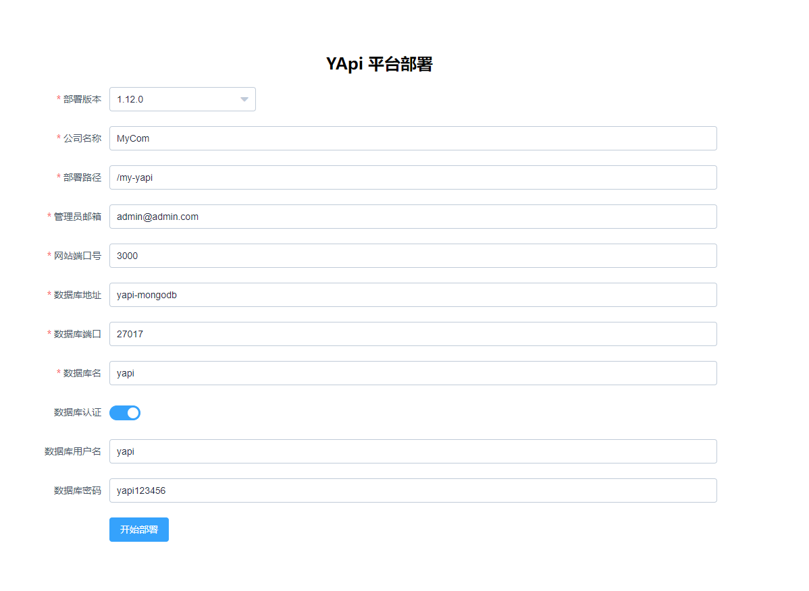

# 基于Docker的YAPI私有部署

## 私有化部署说明
### Step 1 启动Docker容器
```bash
docker-compose up
```

### Step 2 添加MongoDB用户
打开 `mongo-init.sh` 文件，依次执行。
主要的就是添加，yapi的数据库和访问用户。

例如, 数据库 `yapi`, 访问用户 `yapi`, 访问密码：`yapi123456` 

### Step 3 访问YAPI部署地址
浏览器访问 YAPI部署地址：http://localhost:9090



部署完成时日志中有显示登录账户和密码。不过如果你忘记了初始密码通常为 `ymfe.org` 。

### Step 4 停止Docker容器
```bash
docker-compose down
```
`docker-compose.yml` 修改为如下内容
```yaml
# ...
services:
  yapi:
    # 第一次启动使用
    # command: "yapi server"
    # ports:
    #   - 9090:9090
    # 安装成功后运行
    command: "node /my-yapi/vendors/server/app.js"
    ports:
      - 3000:3000
# ...
```
### Step 5 再次启动Docker容器
```bash
docker-compose up
```

### Step 6 访问YAPI
浏览器访问：http://localhost:3000


## 许可
Derek Li © MIT
